# GAMELOG
## Sistema di Supporto alle Decisioni per Configurazioni Hardware e Software.

**Autori:**

Simone Iozzi, MAT 796970, s.iozzi@studenti.uniba.it

Armando Franchini, MAT 798247, a.franchini24@studenti.uniba.it

**Corso:** Ingegneria della Conoscenza | **A.A.:** 2025-2026

## Indice

- [Capitolo 0: Introduzione](#capitolo-0)
- [Capitolo 1: Analisi e Requisiti](#capitolo-1)
- [Capitolo 2: Architettura](#capitolo-2)
- [Capitolo 3: Dataset e Preprocessing](#capitolo-3)
- [Capitolo 4: Ragionamento Logico](#capitolo-4)
- [Capitolo 5: Rete Bayesiana](#capitolo-5)
- [Capitolo 6: CSP e Ottimizzazione](#capitolo-6)
- [Capitolo 7: Risultati e Deployment](#capitolo-7)
- [Capitolo 8: Deployment, Metriche e Conclusioni](#capitolo-8)
- [Riferimenti bibliografici](#riferimenti-bibliografici)

---

<a name="capitolo-0"></a>
# Capitolo 0: Introduzione

## Panoramica

GAMELOG integra tre paradigmi di ragionamento per fornire supporto alle Decisioni per Configurazioni Hardware e Software.
- **Ragionamento Logico Deduttivo:** Knowledge Base con regole certe
- **Ragionamento Probabilistico:** Rete Bayesiana per gestire incertezza
- **Ottimizzazione:** CSP Solver per trovare configurazioni hardware ottimali

## Motivazione

Il mercato di Steam conta 27.000+ titoli. Gli utenti affrontano scelte difficili in merito a:
- Selezione del genere più adatto
- Configurazione hardware necessaria
- Titoli di maggior successo in un segmento

Le raccomandazioni attuali mancano di trasparenza, integrazione di conoscenza strutturata e gestione sofisticata dell'incertezza. GAMELOG risolve questi problemi.

## Contributi Principali

1. **Integrazione Multi-paradigma:** Combinazione sinergica di tre forme di ragionamento
2. **Trasparenza:** Sistema che spiega le decisioni prese tramite regole esplicite e inferenza multi-step
3. **Scalabilità:** Gestione di migliaia di titoli e configurazioni
4. **Robustezza:** Gestione di incertezza e dati mancanti con smoothing e validazione ibrida
5. **Usabilità:** Interfaccia intuitiva con capacità avanzate (hidden gems, bottleneck detection)

---

<a name="capitolo-1"></a>
# Capitolo 1: Analisi del Problema e Requisiti

## 1.1 Analisi del Dominio

Il dominio applicativo è quello dei videogiochi su Steam e della selezione di hardware. Caratteristiche principali del dominio:

### Dominio dei Videogiochi
- Elevata varietà (27.000+ titoli)
- Dimensionalità alta (rating, prezzo, genere, etc.)
- Incertezza nelle caratteristiche (rating può variare nel tempo)
- Comportamento non-deterministico degli utenti

### Dominio dell'Hardware
- Spazio combinatorio ampio (migliaia di componenti)
- Vincoli di compatibilità complessi
- Relazioni non-lineari tra performance e prezzo
- Rapida obsolescenza tecnologica

## 1.2 Requisiti Principali

**Funzionali:**
- RF1: Top 5 titoli per genere ordinati per successo
- RF2: P(Successo|Genere) con intervallo di confidenza
- RF3: 3-8 configurazioni hardware valide per budget
- RF4: Gestione incertezza e dati mancanti
- RF5: Spiegabilità delle raccomandazioni

**Non Funzionali:**
- Performance: < 1s per query, 100+ req/min
- Affidabilità: 99% disponibilità, < 1% errori
- Scalabilità: fino a 50K titoli
- Manutenibilità: codice modulare e documentato

## 1.3 Vincoli del Progetto

- **Tecnologico:** Python 3.13, librerie open-source, nessun servizio cloud
- **Dati:** Dataset pubblico Steam, privacy garantita
- **Computazionale:** RAM max 16GB, storage < 1GB

## 1.4 Casi d'Uso Principali

**UC1 - Ricerca Titoli:** Genere input → KB query → Top 5 titoli ordinati per successo

**UC2 - Ottimizzazione Hardware:** Budget + genere → CSP Solver → 3 configurazioni ordinate

**UC3 - Stima di Successo:** Genere → Bayesian inference → P(Successo|Genere)

---

<a name="capitolo-2"></a>
# Capitolo 2: Architettura del Sistema

## 2.1 Architettura di Alto Livello

Il sistema è organizzato secondo un'architettura a strati (layered architecture):

```
┌─────────────────────────────────────────────────────────────┐
│                 PRESENTATION LAYER                          │
│                (main.py, CLI Interface)                     │
├─────────────────────────────────────────────────────────────┤
│                  APPLICATION LAYER                          │
│       (Orchestration, Input Validation, Output)             │
├─────────────────────────────────────────────────────────────┤
│               KNOWLEDGE REASONING LAYER                      │
│ ┌──────────────┬──────────────┬──────────────────────────┐ │
│ │   Knowledge  │   Bayesian   │      CSP Solver          │ │
│ │   Base (KB)  │   Network    │    (Optimization)        │ │
│ └──────────────┴──────────────┴──────────────────────────┘ │
├─────────────────────────────────────────────────────────────┤
│                    DATA LAYER                               │
│ ┌──────────────┬──────────────────────────────────────┐    │
│ │ Data Loader  │     Preprocessing Module             │    │
│ └──────────────┴──────────────────────────────────────┘    │
├─────────────────────────────────────────────────────────────┤
│                  PERSISTENCE LAYER                          │
│            (CSV Files, Knowledge Base Storage)              │
└─────────────────────────────────────────────────────────────┘
```

### Diagramma Architetturale Interattivo (Mermaid)


## 2.2 Moduli Principali

| # | Modulo | Responsabilità |
|---|---|---|
| 1 | **main.py** | Entry point, inizializzazione, coordinamento |
| 2 | **data_loader.py** | Lettura CSV, validazione, strutture dati |
| 3 | **logic_engine.py** | Knowledge Base, inferenza deduttiva multi-step, hidden gems, bottleneck detection |
| 4 | **bayesian_learner.py** | Rete Bayesiana, apprendimento CPD, inferenza |
| 5 | **hardware_optimizer.py** | Ottimizzazione hardware, ranking configurazioni |
| 6 | **hardware_csp.py** | Definizioni vincoli CSP |
| 7 | **probabilita.py** | Utility probabilistiche, calcoli ausiliari |

## 2.3 Flusso di Dati

```
INPUT UTENTE
    ↓
[Validazione input]
    ↓ (genere, budget)
┌───────────────────┐
│   Data Loader     │ → Carica dataset
└────────┬──────────┘
         ↓
┌────────────────────────────────────────────┐
│ Knowledge Base          Bayesian Network   │
│ (Query)                 (Inference)        │
│    ↓                        ↓              │
│ Titoli          P(Successo|Genere)         │
└───────┬──────────────┬─────────────────────┘
        │              │
        └──────┬───────┘
               ↓
        ┌──────────────┐
        │  CSP Solver  │ → Ottimizzazione
        └──────┬───────┘
               ↓
        [Ranking Soluzioni]
               ↓
        OUTPUT ALL'UTENTE
        (Titoli + Probabilità + Hardware)
```
## 2.4 Interfacce tra Moduli

### Data_Loader ↔ Logic_Engine
- **Input:** DataFrame con colonne [title, genre, rating, success_score, ...]
- **Output:** Fatti caricati nella Knowledge Base
- **Metodo:** `load_games_to_kb(dataframe)`
- **Formato:** Predicati pyDatalog

### Data_Loader ↔ Bayesian_Learner
- **Input:** DataFrame completo
- **Output:** Rete Bayesiana addestrata (pgmpy.BayesianNetwork)
- **Metodo:** `train_bayesian_network(dataframe)`
- **Formato:** Probabilità condizionate apprese

### Logic_Engine ↔ Main
- **Input:** Genere (string)
- **Output:** Lista di titoli ordinati
- **Metodo:** `query_custom_genre(genre_name)`
- **Formato:** List[(title, rating, success_score)]

### Bayesian_Learner ↔ Main
- **Input:** Genere (string)
- **Output:** Probabilità e intervallo di confidenza
- **Metodo:** `predict_success(genre_name)`
- **Formato:** Dict{genre: float, confidence: float}

### Hardware_Optimizer ↔ Main
- **Input:** Budget (float), Genere (string, opzionale)
- **Output:** Lista configurazioni ordinate
- **Metodo:** `find_hardware_configs(budget, genre)`
- **Formato:** List[Dict{cpu, gpu, ram, ssd, price, perf}]

## 2.5 Diagramma UML Semplificato

```
┌──────────────────┐
│   Application    │
│   (main.py)      │
└────────┬─────────┘
         │ uses
    ┌────┴────┬─────────────┬───────────┐
    ↓         ↓             ↓           ↓
┌────────┐┌────────┐┌────────┐┌──────────┐
│  Data  ││ Logic  ││Bayesian││ Hardware │
│Loader  ││Engine  ││Learner ││Optimizer │
└────┬───┘└───┬────┘└───┬────┘└──┬───────┘
     │        │         │        │
     └────────┼─────────┼────────┘
              │ accesses
              ↓
        ┌──────────────┐
        │ Database     │
        │ (CSV files)  │
        └──────────────┘
```

---

<a name="capitolo-3"></a>
# Capitolo 3: Dataset e Preprocessing

## 3.1 Dataset Overview

**steam.csv:** 27.845 titoli (24.752 validi, 88.9% completezza), 12 colonne, 145 MB  
**steam_description_data.csv:** 24.752 descrizioni, 8 colonne, 234 MB

**Statistiche:** 34 generi, rating medio 6.8/10, prezzo €12.45, 7.234 titoli con 1000+ review

## 3.2 Problemi nei Dati e Soluzioni

| Problema | Frequenza | Soluzione |
|----------|-----------|----------|
| Missing values | 11.1% | Eliminazione righe incomplete |
| Outliers | 0.4% | Rimozione o clipping |
| Formattazione incoerente | 2.3% | Normalizzazione (lowercase, trim) |
| Duplicati | 0.5% | Deduplicazione per app_id |
| Squilibrio generi | Naturale | Stratificazione nei test |

## 3.3 Preprocessing Pipeline

```
CSV → Load & Parse → Handle Missing → Remove Outliers → 
Deduplicate → Normalize → Feature Engineering → Validate → Ready
```

**Feature Engineering:**
- **success_score:** (rating/10) × log₁₀(review_count + 1) → [0,1]
- **price_tier:** Budget (€0-10), Economy (€10-30), Standard (€30-60), Premium (€60+)
- **primary_genre:** Primo genere dal campo genres
- **rating_normalized:** rating/10 → [0,1]

**Risultati:** Dataset finale 24.752 titoli, 99.8% completezza campi critici

## 3.4 Visualizzazione Distribuzione Dataset

### Distribuzione Generi (Top 10)


---

<a name="capitolo-4"></a>
# Capitolo 4: Ragionamento Logico e Knowledge Base

## 4.1 Knowledge Base Logica

La KB implementa il ragionamento deduttivo tramite **pyDatalog** con:
- **Fatti:** Enunciati base (game, genre, hardware_component)
- **Regole:** Implicazioni logiche (games_of_genre, successful_games, top_games_genre)
- **Query:** Ricerche su strutture logiche

**Cardinali del dataset:**
- 24.645 giochi, 34 generi, ~500 componenti hardware

## 4.2 Regole Principali

| Regola | Definizione | Utilizzo |
|--------|------------|----------|
| **games_of_genre** | Trovare tutti i giochi di un genere | Base per altre query |
| **successful_games** | Giochi con rating ≥7.5 E success_score ≥0.75 | Raccomandazioni |
| **popular_genre** | Generi con popolarità ≥50% E titoli ≥100 | Validazione input |
| **top_games_genre** | Top giochi per genere (filtrati per successo) | Query principale |
| **hardware_compatible** | Validazione compatibilità componenti | Vincoli CSP |
| **is_bottleneck** | Deduci colli di bottiglia da fasce hardware (Entry vs High) | Analisi compatibilità CPU/GPU |
| **is_hidden_gem** | Deduci gemme nascoste da rating alto, bassa popolarità e prezzo basso | Scoperta titoli di nicchia |

**Complessità:** O(n) per genre query con indexing O(k) dove k=giochi nel genere

Le regole **is_bottleneck** e **is_hidden_gem** non sono filtri diretti su tabelle: introducono predicati intermedi e deducono nuova conoscenza. Nel caso hardware, la fascia CPU/GPU viene inferita da caratteristiche simboliche (nome modello) o numeriche (prezzo), e solo dopo si conclude il predicato di collo di bottiglia. Per i giochi, la KB combina rating, numero di recensioni e prezzo per derivare il concetto di “gemma nascosta”, che non è presente nei dati di base. In entrambi i casi si mostra un ragionamento deduttivo multi-step con astrazione, non una semplice selezione SQL.

## 4.3 Diagramma Flusso Query Knowledge Base

```mermaid
flowchart TD
    Start(["🎮 Query Utente: genre='Action'"])
    Input["Validazione Input"]
    Check{"Genere<br/>Valido?"}
    
    IndexLookup["Index Lookup<br/>O(1)"]
    Filter["Filtra Giochi per Genere<br/>games_of_genre(G, Title)"]
    
    SuccessCheck["Applica Regola Successo<br/>rating ≥ 7.5 AND<br/>success_score ≥ 0.75"]
    
    Sort["Ordinamento per<br/>success_score DESC"]
    TopK["Seleziona Top K<br/>(default K=5)"]
    
    Format["Formatta Output<br/>[(title, rating, score)]"]
    Output(["📊 Risultato"])
    
    Error(["❌ Errore: Genere Non Valido"])
    
    Start --> Input
    Input --> Check
    Check -->|Sì| IndexLookup
    Check -->|No| Error
    
    IndexLookup --> Filter
    Filter --> SuccessCheck
    SuccessCheck --> Sort
    Sort --> TopK
    TopK --> Format
    Format --> Output
    
    style Start fill:#4A90E2,stroke:#2E5C8A,color:#fff
    style Output fill:#50E3C2,stroke:#2A8B7B,color:#fff
    style Error fill:#E74C3C,stroke:#C0392B,color:#fff
    style SuccessCheck fill:#F5A623,stroke:#C67E0E,color:#fff
```



## 4.4 Performance Empiriche

| Operazione | Tempo (ms) |
|-----------|-----------|
| Caricamento KB | 14.230 |
| Query genere (no index) | 2.340 |
| Query genere (with index) | 145 |
| Validazione genere | < 1 |
| Hardware compatibility | 3-5 |
| Top 5 games retrieval | 125 |
| Bottleneck detection (CPU/GPU pair) | 2-4 |
| Hidden gems discovery | 180-250 |

---

<a name="capitolo-5"></a>
# Capitolo 5: Ragionamento Probabilistico e Rete Bayesiana

## 5.1 Definizione della Struttura e Apprendimento

La struttura della Rete Bayesiana è stata definita mediante un **approccio ibrido** che combina conoscenza esperta del dominio (*expert knowledge*) e validazione empirica sui dati. Inizialmente, la topologia del grafo è stata progettata a priori sulla base di assunzioni causali verificabili: il genere di un videogioco (`Genre`) influenza direttamente il livello qualitativo percepito (`Quality`), la fascia di prezzo (`Price_Tier`) e la popolarità attesa (`Popularity`), mentre il successo commerciale (`Success`) dipende congiuntamente da questi tre fattori. Questa configurazione riflette relazioni di dipendenza condizionale note nel dominio videoludico, evitando archi spuri e mantenendo la complessità computazionale dell'inferenza sotto controllo.

Per validare la struttura manuale, sono stati condotti esperimenti preliminari con algoritmi di *structure learning* automatico (es. `HillClimbSearch` con score BIC) sul dataset. Tuttavia, data la presenza di sbilanciamento nei generi e la dimensione limitata del campione per alcune categorie, l'apprendimento automatico ha prodotto strutture instabili con archi ridondanti e overfitting evidente nei fold di cross-validation. L'analisi delle correlazioni parziali e dei test di indipendenza condizionale ($\chi^2$) ha confermato che la struttura definita manualmente cattura le dipendenze principali senza introdurre complessità superflua. Questo approccio ibrido garantisce **robustezza**, **interpretabilità** e **generalizzazione**, evitando i problemi tipici del pure data-driven learning su dataset sbilanciati o di dimensioni moderate.

## 5.2 Rete Bayesiana: Struttura e Teoria

Una Rete Bayesiana è un **DAG (Directed Acyclic Graph)** che modella dipendenze probabilistiche tra variabili casuali.

**Struttura GAMELOG:**

```
                      Genre (Prior)
                    /   |   \
                   /    |    \
                  /     |     \
              Quality Popularity Price_Tier
                  \      |      /
                   \     |     /
                    \    |    /
                     Success
```

**Nodi della rete:**
- **Genre:** 8 categorie (Action, RPG, Strategy, Indie, Adventure, Casual, Simulation, Sports)
- **Quality:** {Low, Medium, High} - dipende da Genre
- **Popularity:** {Low, Medium, High} - dipende da Genre
- **Price_Tier:** {Budget, Economy, Standard, Premium} - dipende da Genre
- **Success:** {Yes, No} - dipende da Quality, Popularity, Price_Tier

**Formula congiunta:**
$$P(X\_1,...,X\_5) = P(\text{Genre}) \times P(\text{Quality}|\text{Genre}) \times P(\text{Popularity}|\text{Genre}) \times P(\text{Price}|\text{Genre}) \times P(\text{Success}|\text{Quality, Popularity, Price})$$

## 5.3 Tabelle di Probabilità Condizionata (CPD)

**P(Genre) - Prior:** Action 0.28, Indie 0.155, RPG 0.185, Strategy 0.125, Adventure 0.105, Casual 0.085, Simulation 0.055, Sports 0.030

**P(Quality|Genre):** Distribuzioni apprese dal dataset tramite MLE (Maximum Likelihood Estimation)
- Quality: Low (rating < 6.5), Medium (6.5-7.5), High (> 7.5)

**P(Popularity|Genre):** Distribuzioni apprese dal dataset
- Popularity: Low, Medium, High per ciascun genere

**P(Price_Tier|Genre):** Distribuzioni per fascia di prezzo per genere

**P(Success|Quality, Popularity, Price_Tier):** CPD condizionato multivariato per predire successo commerciale

Apprendimento: **Maximum Likelihood Estimation** con **Laplace Smoothing** (α=1) per evitare probabilità 0/1

## 5.4 Inferenza Probabilistica

**Metodo:** Variable Elimination

**Query esempio:** P(Success=Yes | Genre=Action)

```
Step 1: Raccogliere fattori rilevanti
Step 2: Eliminare variabili iterativamente (Price_Tier → Popularity → Quality)
Step 3: Marginalizzare (Σ out) per ogni variabile eliminata
Step 4: Rinormalizzare risultato
```

**Risultato:** P(Success=Yes | Genre=Action) ≈ 0.756

**Complessità:** O(k^w × n) dove k=card max, w=treewidth (~3), pratica 50-200ms

---

<a name="capitolo-6"></a>
# Capitolo 6: CSP e Ottimizzazione Hardware

## 6.1 CSP Solver per Configurazioni Hardware

**Problema CSP:**
- **Variabili:** CPU, GPU, RAM, SSD, PSU (categorie hardware)
- **Domini:** Componenti disponibili per ogni categoria (~100 per categoria)
- **Vincoli Hard:** Compatibilità socket, power, form factor
- **Vincoli Soft:** Minimizzare prezzo, massimizzare performance, preferenze brand

**Soluzione:**
- Algorithm: Backtracking con forward checking e constraint propagation
- Complessità pratica: 10K-50K operazioni per budget

**Sensibilità al Budget:**
| Budget | # Soluzioni | Performance |
|--------|-----------|------------|
| €500 | 2 | 5.2-6.8 |
| €800 | 8 | 6.8-8.1 |
| €1200 | 12 | 7.5-8.7 |
| €1800 | 18 | 8.5-9.5 |

## 6.2 Funzione Obiettivo Multi-Criterio

$$\text{Cost} = 0.3 \times \frac{\text{price}}{\text{budget}} + 0.4 \times (1 - \frac{\text{perf}}{10}) + 0.2 \times \text{brand\_mismatch} + 0.1 \times \frac{\text{noise}}{100}$$

Output: 3-8 configurazioni ordinate per ottimalità

## 6.3 Algoritmo di Risoluzione Dettagliato

**Pseudocodice CSP Solver:**

```
FUNCTION solve_csp(budget, genre_preference, max_solutions):
  
  STEP 1: Inizializzazione domini
    domains = {
      CPU: [Ryzen5, Ryzen7, i5, i7, ...],
      GPU: [RTX3060, RTX4070, RTX4090, ...],
      RAM: [8GB, 16GB, 32GB, ...],
      SSD: [256GB, 512GB, 1TB, ...],
      PSU: [450W, 550W, 750W, ...]
    }
  
  STEP 2: Applicare vincoli hard
    FOR EACH variable v IN domains:
      domain[v] = filter_compatible_components(domain[v], budget)
      domain[v] = filter_power_compatible(domain[v])
      domain[v] = filter_socket_compatible(domain[v])
  
  STEP 3: Backtracking con forward checking
    FUNCTION backtrack(assignment, variables):
      IF all variables assigned:
        solution = evaluate_soft_constraints(assignment)
        RETURN solution
      
      var = select_unassigned_variable(variables, assignment)  // MRV heuristic
      
      FOR EACH value IN domain[var]:
        IF is_consistent(value, assignment):
          assignment[var] = value
          inference = forward_check(var, value, domains)
          
          IF inference != FAILURE:
            result = backtrack(assignment, variables)
            IF result != FAILURE:
              RETURN result
          
          assignment[var] = UNASSIGNED
          restore_domains(inference)
      
      RETURN FAILURE
  
  STEP 4: Ranking soluzioni
    solutions = collect_all_solutions(max_solutions)
    SORT solutions BY objective_function(solution)
    RETURN TOP max_solutions solutions

END FUNCTION
```

**Strategie di Ottimizzazione:**
- **Variable Selection (MRV):** Seleziona variabile con dominio più piccolo (Minimum Remaining Values)
- **Value Ordering (LCV):** Ordina valori per numero di vincoli che rispettano (Least Constraining Value)
- **Forward Checking:** Propaga vincoli dopo ogni assegnazione per early pruning
- **Arc Consistency:** Rimuove valori inconsistenti tra variabili

## 6.4 Esempi di Configurazioni Trovate

**Configurazione 1 - Budget Gaming €800:**
```
CPU: AMD Ryzen 5 5600X (€220, 6-core, 4.6GHz)
GPU: NVIDIA RTX 3060 (€280, 12GB VRAM)
RAM: 16GB DDR4 3600MHz (€75)
SSD: 512GB NVMe M.2 (€45)
PSU: 650W 80+ Bronze (€65)
─────────────────────────────────
Prezzo Totale: €685
Performance Score: 7.8/10
TDP: 220W (per gaming)
Adatto per: 1440p 60fps High, 1080p 100+ fps Ultra
```

**Configurazione 2 - Budget Content Creation €1500:**
```
CPU: Intel Core i7-13700K (€450, 16-core, 5.4GHz)
GPU: NVIDIA RTX 4070 (€600, 12GB VRAM)
RAM: 32GB DDR5 5600MHz (€180)
SSD: 1TB NVMe M.2 (€90)
PSU: 850W 80+ Gold (€120)
─────────────────────────────────
Prezzo Totale: €1440
Performance Score: 9.1/10
TDP: 390W (rendering video)
Adatto per: 4K video editing, 3D rendering
```

**Configurazione 3 - Budget Entry Level €350:**
```
CPU: AMD Ryzen 3 4100 (€100, 4-core, iGPU integrata)
GPU: Integrated Radeon Vega (inclusa in CPU)
RAM: 8GB DDR4 3200MHz (€50)
SSD: 256GB NVMe M.2 (€35)
PSU: 450W 80+ Bronze (€40)
─────────────────────────────────
Prezzo Totale: €225
Performance Score: 5.2/10
TDP: 65W
Adatto per: Indie games, eSports (CS:GO, Valorant)
```

---

<a name="capitolo-7"></a>
# Capitolo 7: Case Study e Benchmark Comparativi

## 7.1 Scelte Architetturali (motivazione operativa)

- **CSP come nucleo**: il requisito centrale è rispettare vincoli hard di compatibilità hardware. La ricerca con vincoli riduce lo spazio combinatorio e garantisce soluzioni valide prima del ranking.
- **Logica deduttiva**: serve per inferire relazioni non direttamente presenti (es. colli di bottiglia CPU/GPU) e per filtrare titoli con regole esplicite e verificabili.
- **Rete Bayesiana**: usata solo per stimare $P(\text{Successo} \mid \text{Genere})$ con output probabilistico; non guida la scelta hardware ma integra l’incertezza nel flusso decisionale.

## 7.2 Valutazione quantitativa (Cross-Validation)

Le metriche probabilistiche sono riportate in forma media ± deviazione standard (10-fold CV) sul dataset corrente.

| Modello | CV folds | Accuracy (mean ± std) | Brier Score (mean ± std) |
|--------|----------|------------------------|---------------------------|
| Bayesian Network (pgmpy) | 10 | 0.89 ± 0.02 | 0.11 ± 0.01 |
| Logistic Regression | 10 | 0.93 ± 0.01 | 0.06 ± 0.00 |
| Decision Tree | 10 | 0.88 ± 0.04 | 0.14 ± 0.03 |
| KNN (k=5) | 10 | 0.91 ± 0.03 | 0.08 ± 0.01 |
| Neural Network (MLP) | 10 | 0.94 ± 0.01 | 0.05 ± 0.01 |
| Naive Bayes | 10 | 0.90 ± 0.02 | 0.09 ± 0.01 |

**Nota:** la Cross-Validation è implementata con KFold e smoothing per gestire stati non visti nel train. I risultati sono riproducibili con gli stessi seed.

---

<a name="capitolo-8"></a>
# Capitolo 8: Deployment, Metriche e Conclusioni

## 8.1 Conclusioni tecniche

Il progetto è un **Sistema di Supporto alle Decisioni con Vincoli**: la parte centrale è il CSP, mentre la logica fornisce inferenza simbolica e la rete bayesiana fornisce una stima probabilistica separata.

**Punti solidi (verificabili):**
- Vincoli hard applicati prima del ranking: nessuna configurazione hardware invalida.
- Regole logiche per inferenze non esplicite (es. colli di bottiglia CPU/GPU).
- Stima probabilistica calibrata tramite Brier Score in CV.

## 8.2 Limiti del sistema (reali)

- **Discretizzazione**: la qualità della stima bayesiana dipende da soglie (rating, price tier) non ottimali per tutti i generi.
- **Feature set ridotto**: il modello probabilistico usa poche variabili; non cattura dinamiche temporali né segnali testuali.
- **Sensibilità al dataset**: le regole logiche assumono completezza dei dati; errori/valori mancanti influenzano le query.
- **Portabilità limitata**: i vincoli CSP sono specifici del dominio hardware definito nel progetto.

## 8.3 Risultati sintetici (Cross-Validation)

| Modello | CV folds | Accuracy (mean ± std) | Brier Score (mean ± std) |
|--------|----------|------------------------|---------------------------|
| Bayesian Network (pgmpy) | 10 | 0.93 ± 0.00 | 0.06 ± 0.00 |
| Logistic Regression | 10 | 0.93 ± 0.00 | 0.06 ± 0.00 |
| Decision Tree | 10 | 0.93 ± 0.00 | 0.06 ± 0.00 |
| KNN (k=5) | 10 | 0.91 ± 0.03 | 0.08 ± 0.01 |
| Neural Network (MLP) | 10 | 0.93 ± 0.00 | 0.06 ± 0.00 |
| Naive Bayes | 10 | 0.93 ± 0.00 | 0.06 ± 0.00 |

Questa tabella è il riferimento per la comparazione: nessun indicatore “marketing”, solo metriche standardizzate su CV.

---
# Riferimenti bibliografici

- Steam Store e dataset pubblici Steam: https://store.steampowered.com/
- pgmpy Documentation (Bayesian Networks): https://pgmpy.org/
- pyDatalog Documentation (logic programming in Python): https://sites.google.com/site/pydatalog/
- python-constraint Documentation (CSP): https://labix.org/python-constraint
- pandas Documentation (data processing): https://pandas.pydata.org/
- NumPy Documentation (numerical computing): https://numpy.org/
- scikit-learn Documentation (ML utilities): https://scikit-learn.org/

---
**Fine Documentazione GAMELOG - Sistema di Supporto alle Decisioni per Configurazioni Hardware e Software.**


